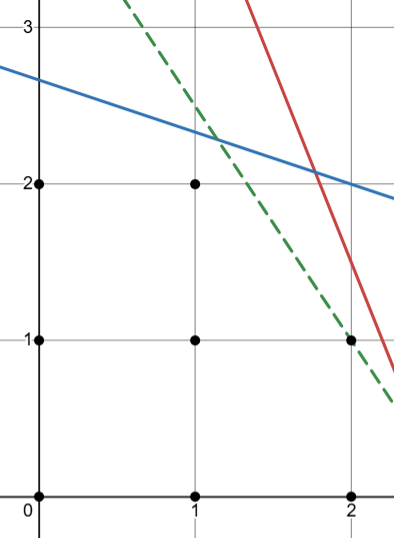

# Safety Order Algorithm
*Ian Lum, Charlie Mawn, Dominic Salmieri*

## Background

### Simplex

The Simplex is an algorithm used for linear programming—the optimization of an objective function given various inequality constraints. Simplex is the most common algorithm for linear programming, solving problems by moving from vertex to vertex in the solution space. The algorithm was invented by George Dantzig, a US Army Air Force logistics planner, in 1946. Dantzig formulated his problems as linear inequalities, then realized the importance of introducing an objective function, adding the notion of a best solution amongst the many feasible solutions.

### Gomory Cuts

The Gomory cut technique is a cutting plane technique used to solve IP problems, similar to the bounding used in Branch and Bound. It was invented by Ralph E. Gomory in 1958. Later, he also introduced a mixed-integer version of his algorithm. Gomory cuts, Gomory mixed-integer cuts, and a version of Gomory cuts called Chvátal–Gomory cuts are still relevant and widely used today in the fields of integer and mixed integer programming.

These are fairly optimal algorithms, and can be improved further using several optimizing heuristics, which can detect when certain theoretical integer solutions are infeasible once Gomory cuts are applied. Certain other choices can be made that affect the performance of the algorithm in different contexts, like the process for picking the row to create the Gomory cut from.

## How it works

### Simplex

The first step of the Simplex algorithm is to rewrite constraints in standard form. Standard form means that inequalities are turned into equal signs by adding **slack variables**. Slack variables represent the amount that the LHS of an inequality is off from the RHS.

Then, each equation needs to have a **basic** variable. Basic variables are variables that have a coefficient of positive one, not including the original variables that are being optimized. For $\leq$ equations, the slack variable serves this purpose but for = and $\geq$ equations, we add **artificial variables**.

### Gomory Cuts
There are several ways to use an LP solver to find the solution to an IP problem, and one of these ways is using cutting planes. The goal of a cutting plane is to remove a non-integral optimal solution while maintaining all possible integer solutions. First, the relaxed IP program is solved. If the solution is non-integral, cutting planes are used to eliminate the solution without removing any integer solutions. Then the LP solver can be run again, which will find a new and potentially integral optimal solution. This process is repeated until an integral solution is found.

*An example cutting plane*

Gomory cuts are a technique for finding cuts that satisfy these criteria. Gomory cuts are made from constraints and the simplex tableau rows associated with them, so first we need to pick a row. Any row associated with a basic variable will work, but oftentimes the row with the right hand side (RHS) value furthest from an integer is chosen. Once a row is picked the Gomory cut is found by removing the integer parts of each coefficient (cell value), leaving the fractional parts of the row, and changing the = constraint to a >= constraint. All values also must be positive, so add 1 if the value is negative. For example:

$$3 x_1 + 3 \frac{2}{5} x_2 - \frac{2}{5} x_3 = 8 \frac{3}{4} \rightarrow \frac{2}{5} x_2 + \frac{3}{5} x_3 \ge \frac{3}{4}$$

This works because the Gomory cut is by definition a stronger constraint than the constraint it came from, but it also doesn’t exclude any integer solutions, which match the criteria that we are looking for. That said, these cuts can make the problem primal infeasible but dual feasible, and would create a tableau that would require the Dual Simplex method to solve.

## Ethics
The algorithm we implemented in code is simple enough that it already has much more built up libraries available that do the same thing. For example, PuLP, which we have used in class before, is an open-source Python library used for linear programming and mixed-integer linear programming problems. However, there are still always ways for algorithms to be misused. One way our algorithm could be misused is through someone trying to solve LP or MILP problems that have direct impacts on people, specifically when those impacts can be harmful. For example, we could imagine a linear program that tries to maximize profit in resource allocation, which can ignore the impact that resource allocation can have on people. If the federal government wanted to use our algorithm to decide where federal funding should go to maximize ‘safety’ from other countries, it could tell them to remove all funding from education just to put it all into defense. This is just one of the possible ways an algorithm like ours could negatively impact people. While this is a possibility, our algorithm was designed with the intention of creating OFAC safety orders, which has its own implications with it. After some discussion together, we decided that the most negatively impactful outcome of our algorithm could be assigning a safety to a performer that has a personal issue with that safety. 

When it comes to bias, we could not identify any areas where our own personal bias went into the design of our algorithm. 

In order to mitigate concerns related to possible misuse of our algorithm, there were a few ideas that came to our minds. Firstly, we could make all of our source code private, so that only we could decide whether someone is allowed to use our algorithm. However, we decided that our code has such a small concern related to it that it is unnecessary to lock our algorithm away from others. This decision was aided in the fact that there are already publicly usable libraries (like PuLP) that can do a much better job at solving these kinds of problems. 

To help us in considering our ethical decisions, we used a few sources: [Incorporating an ethical perspective into problem formulation: implications for decision support systems design](https://dl.acm.org/doi/10.1016/j.dss.2004.02.002) is a publication that claims that decision support systems (like our algorithm) are more than technical artifacts and their implications for affected parties should be considered in their design and development. We also read parts of [Linear Programing Applications; A single-Case Study in Tea Industry](https://www.researchgate.net/publication/354202319_Linear_Programing_Applications_A_single-Case_Study_in_Tea_Industry), which involves a tea-producing company that used linear programming to optimize its product mix based on labor capacity, machine capacity, raw materials, and demand constraints. The objective was to maximize profit while satisfying all constraints. The study provided policy-making suggestions for production planning and scheduling. While the primary focus was on profit maximization, the ethical consideration here is the balance between maximizing profit and ensuring fair labor practices, sustainable resource use, and meeting customer demand.

## Example Application

Our application of this algorithm was what inspired us to pursue this project. All of us are member of the Olin Fire Arts Club, a club at Olin where we spin props on fire (Wikipedia: [Fire art](https://en.wikipedia.org/wiki/Fire_art)). For our performances, the leaders of the club spend time taking in all the groups of performers, the props they are spinning, the experience levels of each performer, and a few other small factors, and create a safety order: The main list of who will be doing what role, and when they will be doing it. The role breakdown is as follows:
 - **Performer**: 
Up to 3 people will be actively performing for the audience, spinning a specific prop to a specific song
- **Safety**: 
Standard to have 5 safeties for each performance, where the safety will be actively paying attention to the performer(s) and provide aid if anyone were to injure themselves.
- **Music Master**: 
One person per performance will be controlling the music for the show, one thing to note is that many people in the club have a specific preference to not be the music master, which is another key constraint when the leaders make the safety order

Our goal with the implementation of the algorithm is to automate this process of assigning roles to all the people in the performance. We knew that this would be a good utilization of mixed integer linear programming because there are many identifiable constraints that make the process of creating a safety order complicated.

So, we decided that our goal was to optimize the ‘evenness’ of safety slots. This means that our goal was for everyone to safety a performance an even number of times.

In order to apply our algorithm to this problem, there were not many alteration that needed to be made, our problem is a very good candidate for a linear programming problem. However, we did have to simplify our problem a fair amount to feasibly have a deliverable by the end of the process. 

Since our algorithm is very generic, it can be used for a wide range of problems outside of safety order creation, including food and agriculture, engineering, transportation, manufacturing, and energy. 

### Definitions
- $o =$ OFACer index, each person in the performance
- $r =$ row index, each performance
- $c =$ column index, each safety position
- $P =$ performer binary, where $P_{or}$ is $1$ when OFACer $o$ is performing in performance $r$
- $S =$ safety binary, where $S_{orc}$ is $1$ when OFACer $o$ is safetying in performance $r$ in safety position $c$
- $M =$ music master binary, where $M_{or}$ is $1$ when OFACer $o$ is the music master for performance $r$
- $E =$ experienced binary, where $E_{o}$ is $1$ if OFACer $o$ is allowed to be safety 1 or 4

### Givens
- Performance order
- Music masters

### Constraints
Only one role per person per row

$$P_{or} + \sum_{c=1}^{5}s_{orc} + m_{or} \le 1, \forall \ r \in R, \forall \ o \in O$$

Can't safety right before or after your performance

$$P_{or} \left( \sum_{c=1}^{5} \left( S_{o(r-1)c} + S_{o(r+1)c} \right) \right) = 0, \forall \ r \in R, \forall \ o \in O$$

Experienced safeties in slots 1 and 4

$$S_{or1} \le E_{o}, \forall \ r \in R, \forall \ o \in O$$

$$S_{or4} \le E_{o}, \forall \ r \in R, \forall \ o \in O$$

At least two safeties must stay the same between performances 

$$\sum_{o=1}^{O} \sum_{c=1}^{C} S_{orc} * S_{o(r+1)c} \ge 2, \forall \ r \in R$$

### Optimization
$$\text{min } Z=\sum_{o=1}^{O} \left(\sum_{r=1}^{R} \sum_{c=1}^{C} s_{orc} - \frac{5|R|}{|O|}\right)^2$$

### Current limitations and possible improvements
- Performance order isn't optimized, and there may be infeasible performance orders
- Props aren't considered, so safety 5 is still filled for long props
- Optimize for minimizing swaps
- Include music master in optimization 

## Setup

For this project, we used [numpy](https://numpy.org/) when implementing our Linear and Integer programming solvers. We also tested our constraints using [PuLP](https://coin-or.github.io/pulp/).

These packages are listed in [`requirements.txt`](./requirements.txt) and can be installed using `pip install -r requirements.txt`

## Resources

Listed here are the resources we used for this project:
- [The Two-phase Simplex Method: An Example](https://www.youtube.com/watch?v=_wnqe5_CLU0) - Sergiy Butenko
- [Simplex algorithm](https://en.wikipedia.org/wiki/Simplex_algorithm) - Wikipedia
- [Branch and cut](https://en.wikipedia.org/wiki/Branch_and_cut) - Wikipedia
- [Cutting-plane method](https://en.wikipedia.org/wiki/Cutting-plane_method) - Wikipedia
- [Gomory Cuts and a little more](https://ocw.mit.edu/courses/15-053-optimization-methods-in-management-science-spring-2013/4717f89c50e91aaa455dbe9cb5a3e225_MIT15_053S13_tut11.pdf) - MIT OpenCourseWare
- [Generating Gomory's Cuts for linear integer programming problems:  the HOW and WHY](https://www.ou.edu/class/che-design/che5480-11/Gomory%20Cuts-The%20How%20and%20the%20Why.pdf) - The University of Melbourne